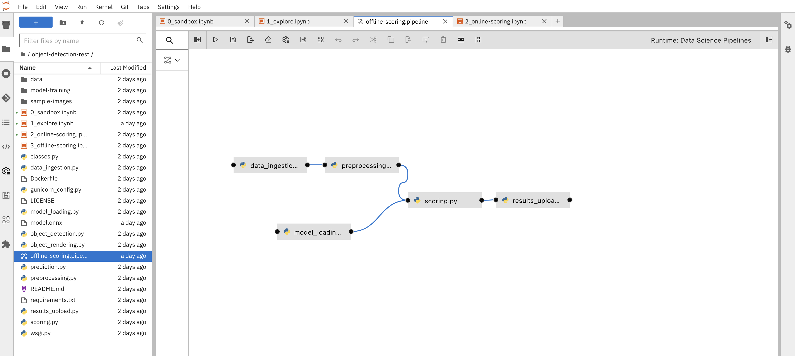

= Section 1

== Introduction to Data Science Pipelines

A data science pipeline typically consists of several key activities that are performed in a structured sequence to transform raw data into meaningful insights or predictions. These activities may include:

* *Data Collection*: Gathering the data from various sources, such as databases, APIs, spreadsheets, or external datasets.

* *Data Cleaning*: Identifying and handling missing or inconsistent data, removing duplicates, and addressing data quality issues to ensure that the data is reliable and ready for analysis.

* *Data Exploration*: Exploring the data to understand its characteristics, including summary statistics, data distributions, and visualizations. This step helps in gaining insights into the data and identifying potential patterns or outliers.

* *Feature Engineering*: Creating or transforming features (variables) to improve the performance of machine learning models. This may involve scaling, one-hot encoding, creating new variables, or reducing dimensionality.

* *Data Preprocessing*: Preparing the data for modeling, which may involve standardizing, normalizing, or scaling the data. This step is crucial for machine learning algorithms that are sensitive to the scale of features.

* *Model Building*: Developing machine learning or statistical models to solve a specific problem or make predictions. This step includes selecting an appropriate algorithm, training the model, and fine-tuning its hyperparameters.

* *Model Evaluation*: Assessing the performance of the model using various metrics, such as accuracy, precision, recall, F1 score, or mean squared error. Cross-validation techniques may be used to ensure the model's robustness.

* *Model Deployment*: Integrating the trained model into a production environment so that it can make real-time predictions or recommendations. This may involve creating APIs, web applications, or embedding the model in an existing software system.

* *Monitoring and Maintenance*: Continuously monitoring the deployed model's performance and making necessary updates or retraining when the model's accuracy decreases over time due to changing data distributions or other factors.

* *Reporting and Visualization*: Communicating the results and insights to stakeholders through reports, dashboards, or interactive visualizations, making it easier for non-technical audiences to understand the findings.

* *Documentation*: Creating documentation for the entire data science pipeline, including data sources, data processing steps, model details, and evaluation metrics. This documentation is essential for reproducibility and collaboration.

* *Collaboration and Communication*: Collaborating with domain experts, stakeholders, and other team members to define project objectives, gather domain knowledge, and align the data science work with the business goals.

These activities are typically iterative and may involve going back and forth between different stages to refine the analysis and models. Data science pipelines can vary depending on the specific project and organization, but these general steps provide a framework for approaching data science tasks.

== Data Science Pipelines in OpenShift AI

From the perspective of a data scientist or ML engineer user experience, OpenShift AI provides several user interface capabilities trying to cover as many as possible from these data science activities. It includes the following

* *Data Science Pipelines Main View* - End users can find the pipelines to whom they have access under the data science pipelines menu / main view

image::dsps-main.png[Data Science Pipelines Menu / Main View]

* *Data Science Pipelines Runs* - When looking for more details, end users explore the runs of their data science pipelines

image::dsps-runs.png[Data Science Pipelines Runs]

* *Data Science Pipelines view within a Data Science Project* - While within their data science project, end users can visualise the runs and other details of pipelines that ran within that project.

image::dsps-in-ds-project.png[Data Science Pipelines view within a Data Science Project]

Those data scientists and ML engineers with access to and knowledge of containers and OpenShift, can also look "under the covers" and check their pipeline runs direct in OpenShift:

* *OpenShift Pipeline executing a Data Science Pipeline* - From the OpenShift Console, under Pipelines->PipelinesRuns one can see the underlying Tekton pipeline that runs in OCP, once a data scientist started a Data Science Pipeline in OpenShift AI

image::dsp-run-in-ocp-pipelines.png[OpenShift Pipeline executing a Data Science Pipeline]

== Data Science Pipelines Technologies

At a high level, here are the technologies used to implement Data Science Pipelines in OpenShift AI:

* *Elyra Pipelines* - A *JupyterLab* extension, which provides a visual editor for creating data science pipelines based on Jupyter notebooks as well as Python or R scripts. User can drag and drop code and create visually such pipelines

A data scientist can assign resources visually, including CPUs and GPUs, to each individual step in the pipeline.

image::../images/elyra-pipeline-step-config-with-gpu.png[Configuring GPUs and other resources for an Elyra pipeline step]

* *Kubeflow Pipelines* - Specialized data science pipelines engine which can translate an Elyra visual pipeline execution (or Kubeflow SDK calls) into a *Tekton* pipeline running in OpenShift.

image::../images/elyra-pipeline-running.png[Starting an Elyra pipeline]
image::../images/elyra-pipeline-job-started.png[Details of a started Elyra pipeline]

* *OpenShift Pipelines (based on Tekton)* - It executes each step in the pipeline as an individual container and ensures that each container gets allocated the resources (GPU, CPU, memory) configured/requested by data scientists in Elyra (or via Kubeflow SDK), as long as they are available in the OpenShift cluster.

* *OpenShift GitOps with ArgoCD for automated model deployments* - While not part of the OpenShift AI but rather as part of OpenShift, it is worth mentioning that once ML models are created, GitOps can be leveraged to push them to other OpenShift instances (including OpenShift Edge devices) for being hosted on model servers for inference and/or embedded in intelligent apps.

For a deep dive and in depth overview of these technologies, please check sections 2 and 3 in this module
