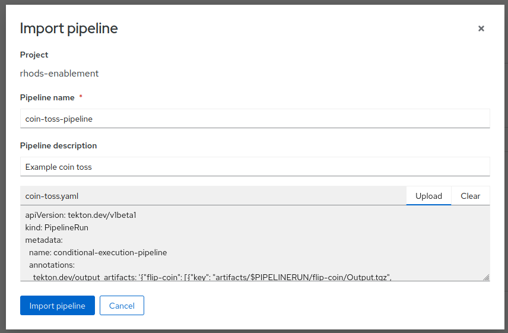

= Introduction

Data Science Pipelines is Red Hat's implementation of Kubeflow Pipelines.  Data Science Pipelines uses OpenShift Pipelines (Tekton) as the execution engine for pipelines, unlike the upstream Kubeflow Pipelines, which utilizes Argo Workflows.

Another important distinction between the upstream Kubeflow Pipelines project and Data Science Pipelines, is that Data Science Pipelines is designed to support multi-tenancy.  Users are able to deploy their own instance of Data Science Pipelines in a namespace using an object called a DataSciencePipelineApplications.

Users are then able to create pipelines using a variety of methods, and submit them to the DataSciencePipelineApplication instance for execution.

== Data Science Pipeline Concepts

* *Pipeline* -  is a workflow definition containing the steps and their input and output artifacts.
* *Run* - is a _single_ execution of a pipeline.  A run can be a one off execution of a pipeline, or pipelines can be scheduled as a _recurring run_.
* *Step* - is a self-contained pipeline component that represents an execution stage in the pipeline.
* *Artifact* - Steps have the ability to create artifacts, which are objects that can be persisted after the execution of the step completes.  Other steps may use those artifacts as inputs and some artifacts may be useful references after a pipeline run has completed.  Artifacts automatically stored by Data Science Pipelines in S3 compatible storage.
* *Experiment* - is a logical grouping of runs for the purpose of organization.

[NOTE]
====
A pipeline is an execution graph of tasks, commonly known as a _DAG_ (Directed Acyclic Graph).
A DAG is a directed graph without any cycles, i.e. direct loops.
====

A data science pipeline is typically implemented to improve the repeatability of a data science experiment.  While the larger experimentation process may include steps such as data exploration, where data scientists seek to create a fundamental understanding of the characteristics of the data, data science pipelines tend to focus on turning a viable experiment into a repeatable solution that can be iterated on.

A data science pipeline, may also fit within the context of a larger pipeline that manages the complete lifecycle of an application, and the data science pipeline is responsible for the process of training the machine learning model.

Data science pipelines may consists of several key activities that are performed in a structured sequence to train a machine learning model. These activities may include:

* *Data Collection*: Gathering the data from various sources, such as databases, APIs, spreadsheets, or external datasets.

* *Data Cleaning*: Identifying and handling missing or inconsistent data, removing duplicates, and addressing data quality issues to ensure that the data is reliable and ready for analysis.

* *Feature Engineering*: Creating or transforming features (variables) to improve the performance of machine learning models. This may involve scaling, one-hot encoding, creating new variables, or reducing dimensionality.

* *Data Preprocessing*: Preparing the data for modeling, which may involve standardizing, normalizing, or scaling the data. This step is crucial for machine learning algorithms that are sensitive to the scale of features.  This step may also include splitting the data into multiple subsets of data including a test and train dataset to allow the model to be validated using data the trained model has never seen.

* *Model Training*: After the data has been split into an appropriate subset, the model is trained using the training dataset.  As part of the training process, the machine learning algorithm will generally iterate through the training data, making adjustments to the model until it arrives at the "best" version of the model.

* *Model Evaluation*: The model performance is assessed with the previously unseen test dataset using various metrics, such as accuracy, precision, recall, F1 score, or mean squared error. Cross-validation techniques may be used to ensure the model's robustness.

A single pipeline may include the ability to train multiple models, complete complex hyperparameter searches, or more.  Data Scientists can use a well crafted pipeline to quickly iterate on a model, adjust how data is transformed, test different algorithms, and more.  While the steps described above describe a common pattern for model training, different use cases and projects may have vastly different requirements and the tools and framework selected for creating a data science pipeline should help to enable a flexible design.

== Data Science Pipelines in OpenShift AI

From the perspective of a data scientist or ML engineer, OpenShift AI provides several user interface capabilities to enable these data science activities. It includes the following:

* *Data Science Pipelines Main View* - Users can find the pipelines that have been uploaded to namespaces they have access to from within the OpenShift AI Dashboard 

image::dsps-main.png[Data Science Pipelines Menu / Main View]

* *Data Science Pipelines Runs* - Users can explore the completed runs of their data science pipelines

image::dsps-runs.png[Data Science Pipelines Runs]

* *Data Science Pipelines view within a Data Science Project* - While within their data science project, end users can visualize the runs and other details of pipelines that ran within that project.

image::dsps-in-ds-project.png[Data Science Pipelines view within a Data Science Project]

When executing a pipeline run, Data Science Pipelines utilizes OpenShift Pipelines (Tekton) as the underlying execution engine.  Users can access additional information and logs from the OpenShift Console from the execution of their runs.

* *OpenShift Pipeline executing a Data Science Pipeline* - From the OpenShift Console, under Pipelines->PipelinesRuns one can see the underlying Tekton pipeline that runs in OpenShift, once a user starts a Data Science Pipeline in OpenShift AI

image::dsp-run-in-ocp-pipelines.png[OpenShift Pipeline executing a Data Science Pipeline]

== Creating Data Science Pipelines

Data Science Pipelines allows users to utilize several different methods for creating and executing pipelines.  This section will discuss some of those options.

* *Elyra Pipelines* - A *JupyterLab* extension, which provides a visual editor for creating data science pipelines based on Jupyter notebooks files (.ipynb), Python files (.py), or R scripts (.r). Elyra enables users to drag and drop files and visually create pipelines

image::elyra-pipeline-offline-scoring.png[An Offline Scoring pipeline in Elyra]
image::elyra-pipeline-model-training.png[A Model Training pipeline in Elyra]

Using Elyra, users can assign resources visually, including CPUs and GPUs, to each individual step in the pipeline.

image::elyra-pipeline-step-config-with-gpu.png[Configuring GPUs and other resources for an Elyra pipeline step]

After constructing a pipeline with Elyra, users can submit a job directly to Data Science Pipelines, where it will be executed.

image::elyra-pipeline-running.png[Starting an Elyra pipeline]
image::elyra-pipeline-job-started.png[Details of a started Elyra pipeline]

* *kfp / kfp-tekton* - kfp and kfp-tekton are Python packages that allow users to write Kubeflow Pipelines using Python.  Users can install the kfp and kfp-tekton python packages using standard package management tools such as pip and users have the ability to import the kfp packages into their python scripts and use them to control all aspects of the pipeline.

With kfp and kfp-tekton users are able to compile pipelines to a YAML object which can then be uploaded to the OpenShift AI Dashboard.

Once uploaded, users are able to execute a run of the pipeline, or schedule a reoccurring run for the pipeline.

Additionally, with the kfp and kfp-tekton packages, users are able to connect directly to the DataSciencePipelineApplication instance from their python environment and execute a run without compiling and manually uploading the pipeline.
