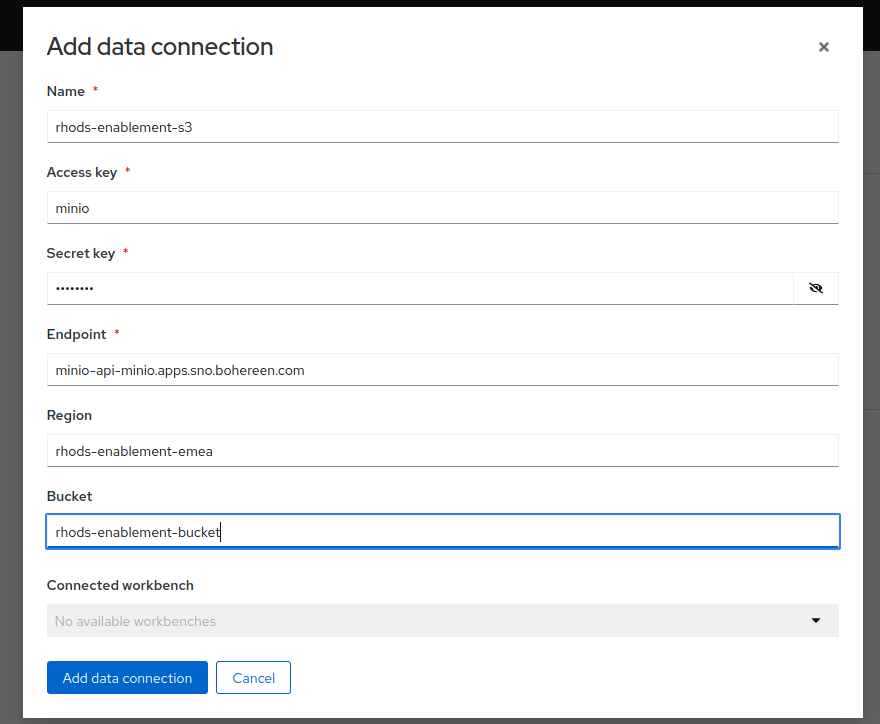
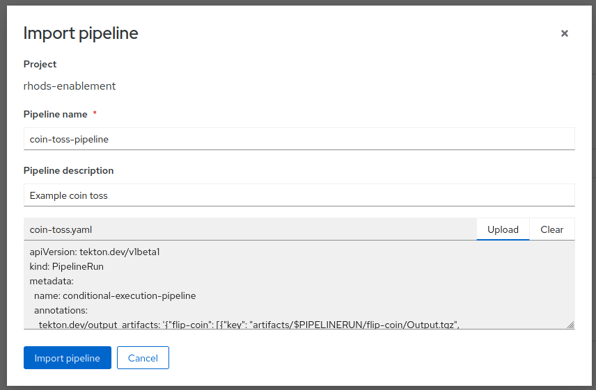
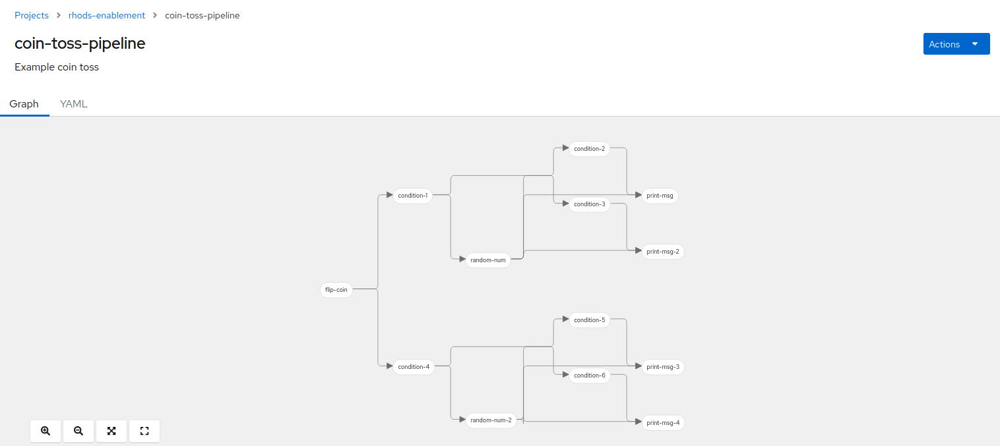
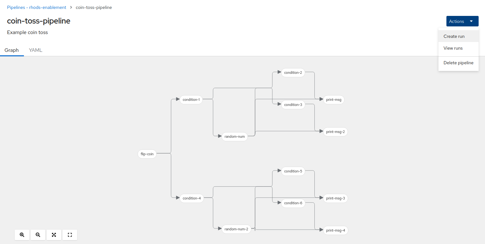

= Section 1

== Introduction to Data Science Pipelines

A data science pipeline is like a recipe for turning raw data into useful insights. Just like when you cook, you follow a set of steps to prepare a meal, in data science, you follow a series of steps to analyze data and extract valuable information. Here's a simple breakdown of what a data science pipeline involves:

1. **Data Collection**: This is where you gather all the data you need for your analysis. Think of it like buying the ingredients for a meal.

2. **Data Cleaning**: Raw data is often messy, like chopping and cleaning vegetables. You need to remove errors, missing values, and any irrelevant information to make the data usable.

3. **Data Exploration**: Here, you get to know your data better. It's like tasting your ingredients to understand their flavors. You create charts, graphs, and summary statistics to discover patterns and relationships in the data.

4. **Feature Engineering**: Just as a chef combines and prepares ingredients in a specific way to create a dish, in data science, you manipulate and transform the data to create new features or variables that can be more informative for your analysis.

5. **Model Building**: This is where the magic happens. You choose a statistical or machine learning model to make predictions or gain insights from your data. It's like following a recipe to cook your meal.

6. **Model Training**: You "train" your model by showing it examples from your data, just as you might train a chef on how to prepare a specific dish.

7. **Model Evaluation**: You taste your dish and assess its quality. Similarly, you evaluate your model's performance using various metrics to ensure it's doing what you want it to do.

8. **Model Deployment**: If your dish is delicious, you serve it to others. In data science, if your model works well, you deploy it so that it can be used to make predictions on new, unseen data.

9. **Monitoring and Maintenance**: Just as a chef may need to adjust the recipe over time to maintain the quality of the dish, data science models may need updates and monitoring to ensure they remain accurate and relevant.

10. **Reporting and Communication**: Finally, you share your findings and insights, much like serving your meal and explaining how it was prepared to your guests.

So, a data science pipeline is like a step-by-step guide that takes raw data, processes it, uses it to build models, and then communicates the results to help make informed decisions or predictions. It's a structured approach to turning data into valuable knowledge.

In more technical terms A *pipeline* is a description of an ML workflow, including all of the components in the workflow and how they combine in the form of a graph. The pipeline includes the definition of the inputs (parameters) required to run the pipeline and the inputs and outputs of each component.

[NOTE]
====
ML Pipleines are a basically an execution graph of tasks, commonly known as a _DAG_ (Directed Acyclic Graph).
A DAG is a directed graph with no cycles aka no direct loops.
====

== Data Science Pipelines in OpenShift AI

OpenShift AI offers two out of the box mechanisms to build Data Science Pipelines.

The first mechanism is the Elyra Jupyter notebook addon which provides a visual editor for creating pipelines via orchestration of Jupyter notebooks. 

The second mechanism and the one discussed here is using Data Science Pipelines (DSP) based on the upstream KubeflowPipelines V1. With DSP, pipelines are built using python scripts using the KFPV1 python SDK. Once built, the python pipeline is submitted to the DSP runtime to be scheduled for execution.

[NOTE]
====
There is work in progress to migrate DSP to Kubeflow Pipeline V2. At the time of writing this is still a work in progress and we won't cover it here.
====

In OpenShift AI we use the *_Tekton_* runtime to execute pipelines. With this there is an additional step to be performed the python script needs to be compiled into a Tekton definition before being submitting to the runtime

In OpenShift AI the Data Science Pipeline runtime consists of the following components:

* A Data Science Pipeline Server container. 
* A MariaDB for storing pipeline definitions and results.
* A Pipeline scheduler for scheduling pipeline runs.
* A Persistent Agent to record the set of containers that executed as well as their inputs and outputs.

Steps in the pipeline are executed as ephemeral pods (one per step).

[NOTE]
====
DS Pipeline in OpenShift AI are managed by the `data-science-pipelines-operator-controller-manager` operator in the `redhat-ods-applications` namespace. The CRD is an instance of _datasciencepipelinesapplications.datasciencepipelinesapplications.opendatahub.io_
====

.DataScience Pipeline pods
****
[source,cmd]
----
 ~/oc get pods -n redhat-ods-applications
NAME                                                              READY   STATUS    RESTARTS   AGE
ds-pipeline-persistenceagent-pipelines-definition-6d6676d58vzss   1/1     Running   0          9m49s
ds-pipeline-pipelines-definition-7c7dd56b4d-qfz8t                 2/2     Running   0          9m49s
ds-pipeline-scheduledworkflow-pipelines-definition-7f5c645hcg4g   1/1     Running   0          9m48s
mariadb-pipelines-definition-795c57795b-27ljh                     1/1     Running   0          9m49s
----
****

== Creating a Data Science Pipeline with the KFP SDK

=== Prerequisites 
****
* Python Setup
[source,cmd]
----
pip install kfp==1.8
pip install kfp-tekton==1.7.2
----

* S3 Storage

Follow these instructions to setup a local Minio instance
https://ai-on-openshift.io/tools-and-applications/minio/minio/
****

=== Creating a Pipeline Server

To execute pipelines a _Pipeline server_ needs to be created but before that can happen an S3 Storage bucket needs to be configured. This is used to store the run artifacts and outputs of any pipeline run on the associated server. 
****

****
Once the data connection is created then the pipeline server can be created
****
image::pre-creating-pipeline-server.png[]
****
****
image::pipeline-server-created.png[]
****
=== Building and deploying a Pipeline

The following is a simplistic example of a KFP pipeline. The original is at 
https://github.com/kubeflow/kfp-tekton/blob/master/samples/flip-coin/condition.py and the example has downloaded it to a file named _coin-toss.py_

****
.Python Pipeline Example
[source,python]
----
# Copyright 2020 kubeflow.org
#
# Licensed under the Apache License, Version 2.0 (the "License");
# you may not use this file except in compliance with the License.
# You may obtain a copy of the License at
#
#      http://www.apache.org/licenses/LICENSE-2.0
#
# Unless required by applicable law or agreed to in writing, software
# distributed under the License is distributed on an "AS IS" BASIS,
# WITHOUT WARRANTIES OR CONDITIONS OF ANY KIND, either express or implied.
# See the License for the specific language governing permissions and
# limitations under the License.

from kfp import dsl
from kfp import components

def random_num(low:int, high:int) -> int:
    """Generate a random number between low and high."""
    import random
    result = random.randint(low, high)
    print(result)
    return result

def flip_coin() -> str:
    """Flip a coin and output heads or tails randomly."""
    import random
    result = 'heads' if random.randint(0, 1) == 0 else 'tails'
    print(result)
    return result

def print_msg(msg: str):
    """Print a message."""
    print(msg)

flip_coin_op = components.create_component_from_func(
    flip_coin, base_image='python:alpine3.6')
print_op = components.create_component_from_func(
    print_msg, base_image='python:alpine3.6')
random_num_op = components.create_component_from_func(
    random_num, base_image='python:alpine3.6')

@dsl.pipeline(
    name='conditional-execution-pipeline',
    description='Shows how to use dsl.Condition().'
)
def flipcoin_pipeline():
    flip = flip_coin_op()
    with dsl.Condition(flip.output == 'heads'):
        random_num_head = random_num_op(0, 9)
        with dsl.Condition(random_num_head.output > 5):
            print_op('heads and %s > 5!' % random_num_head.output)
        with dsl.Condition(random_num_head.output <= 5):
            print_op('heads and %s <= 5!' % random_num_head.output)

    with dsl.Condition(flip.output == 'tails'):
        random_num_tail = random_num_op(10, 19)
        with dsl.Condition(random_num_tail.output > 15):
            print_op('tails and %s > 15!' % random_num_tail.output)
        with dsl.Condition(random_num_tail.output <= 15):
            print_op('tails and %s <= 15!' % random_num_tail.output)

if __name__ == '__main__':
    from kfp_tekton.compiler import TektonCompiler
    TektonCompiler().compile(flipcoin_pipeline, __file__.replace('.py', '.yaml'))
----
****

To compile it into a Tekton resource definition just run the following in a terminal
[source,python]
----
python3 coin-toss.py
----

It will generate a Tekton *_Pipeline Run_* , similar to this snippet
****
[source,yaml]
----
apiVersion: tekton.dev/v1beta1
kind: PipelineRun
metadata:
  name: conditional-execution-pipeline
  annotations:
    tekton.dev/output_artifacts: '{"flip-coin": [{"key": "artifacts/$PIPELINERUN/flip-coin/Output.tgz",
      "name": "flip-coin-Output", "path": "/tmp/outputs/Output/data"}], "random-num":
      [{"key": "artifacts/$PIPELINERUN/random-num/Output.tgz", "name": "random-num-Output",
      "path": "/tmp/outputs/Output/data"}], "random-num-2": [{"key": "artifacts/$PIPELINERUN/random-num-2/Output.tgz",
      "name": "random-num-2-Output", "path": "/tmp/outputs/Output/data"}]}'
    tekton.dev/input_artifacts: '{"print-msg": [{"name": "random-num-Output", "parent_task":
      "random-num"}], "print-msg-2": [{"name": "random-num-Output", "parent_task":
      "random-num"}], "print-msg-3": [{"name": "random-num-2-Output", "parent_task":
      "random-num-2"}], "print-msg-4": [{"name": "random-num-2-Output", "parent_task":
      "random-num-2"}]}'
    tekton.dev/artifact_bucket: mlpipeline
    tekton.dev/artifact_endpoint: minio-service.kubeflow:9000
    tekton.dev/artifact_endpoint_scheme: http://
    tekton.dev/artifact_items: '{"flip-coin": [["Output", "$(results.Output.path)"]],
      "print-msg": [], "print-msg-2": [], "print-msg-3": [], "print-msg-4": [], "random-num":
      [["Output", "$(results.Output.path)"]], "random-num-2": [["Output", "$(results.Output.path)"]]}'
    sidecar.istio.io/inject: "false"
    tekton.dev/template: ''
----
****

The resulting yaml file _(coin-toss.yaml)_ can then be uploaded throught the UI
****

****
****

****
Once imported the structure of the _DAG_ will be shown. Each step in the pipeline will be run as a container on OpenShift.

****

****

To execute the pipeline, click on _Create Run_ in the menu and fill out the _Name_ and _Description_.
If the pipeline has _Input Parameters_ or a you need to schedule a recurring run then that can be configured further down. Once ready clink _Create_ and the pipeline will be scheduled.

****
image::creating-pipeline-run.png[]
****

The pipeline will execute and the outputs will be stored into the configured S3 bucket.
As the pipeline executes the view will be updated to show the steps being executed. It's possible to click on the graph nodes to reveal information of the steps

****
image::post-pipeline-run.png[]
****

Once the pipeline has completed it is possible to access the output and pipeline artifacts (if used) in the Minio Storage UI

****
image::object-store-after-run.png[]
****

== Advanced Example

In this section we're going to demonstrate how Data Science Pipelines work in a real world scenario. 

****
In this scenario we have a remote edge device which uses an AI model to manage the characteristics of its battery usage depending on the environment it's deployed in. On a regular schedule it uploads battery events via a data gateway and those batter events are used to train a model which is then retrieved by the device and used. 

image::openshift-ai-dsp-edge.png[]
****

The entire pipeline is here xref:attachment$sample-pipeline-full.py[Pipeline]

We're not going to go through all of it but focus on the key aspects of it. 

The actual pipeline is defined by the following function

****
[source,python]
include::example$sample-pipeline-full.py[lines=450..454]
****

The '@dsl.pipeline' parameters provide the name and description if you were uploading the pipeline via an API call. The DSP UI overwrites these values.

The function *_edgetest_pipeline_* is the implementation of the pipeline.

=== Pipeline Parameters
The pipeline has four parameters

* _file_obj_ and _src_bucket_ refer to S3 bucket details and can be ignored.
* _VIN_ is the edge device identifier and has a default value of 412356
* _epoch_count_ is the number of training epochs to be used

In the _Create Run_ UI these parameters are available so that users can override the values as they need

****
image::pipeline-parameters.png[]
****

=== Pipeline Steps
The file contains the following python functions which roughly correspond to the steps in the diagram above

* load_trigger_data()
* prep_data_train_model()
* model_upload_notify()
* model_inference()

These functions are mapped into individual containers by using the _create_component_from_func_ function. You can specify the container _base_image_ to use as well as any additional python packages to be installed into the container at execution time.

[source,python]
include::example$sample-pipeline-full.py[lines=433..443]

The python functions can be used in multiple different step definitions; in the example the _prep_data_train_model_ function is used in the _prep_data_train_op_ and the _prep_inference_data_op_ containers.

The pipeline execution _graph_ is created using the following code:

[source,python]
include::example$sample-pipeline-full.py[lines=471]

[source,python]
include::example$sample-pipeline-full.py[lines=477]

[source,python]
include::example$sample-pipeline-full.py[lines=482]

[source,python]
include::example$sample-pipeline-full.py[lines=492]

[source,python]
include::example$sample-pipeline-full.py[lines=495]

IMPORTANT: The execution order of the graph is top down but also can be controlled by using the *_.after()_* operator. 

The following diagram shows the order of execution.

****
image::pipeline-graph.png[]
****

This is also visable in the OpenShift AI user interface:

****
image::oai-pipeline-graph.png[]
****

=== Pipeline Parameter Passing
As each step of our pipeline is executed in an independent container, input parameters and output values are handled as follows

==== Input Parameters

* Simple parameters - booleans, numbers, strings - are passed by value into the container as command line arguments.
* Complex types or large amounts of data are passed via files. The value of the input parameter is the file path.

==== Output Parameters

* Output values are returned via files.

==== Passing Parameters via Files
To pass an input parameter as a file, the function argument needs to be annotated using the _InputPath_ annotation.
For returning data from a step as a file, the function argument needs to be annotated using the _OutputPath_ annotation.

In both cases the actual value of the parameter is the file path and not the actual data. So the pipeline will have to read/write to the file as necessary.

For example in our sample pipeline we use the _parameter_data_ argument of the _prep_data_train_model_ function to return multiple data values as a file, here's the function definition with the _OutputPath_ annotation

[source,python]
include::example$sample-pipeline-full.py[lines=51]

Here's the actual writing of the data to the file

[source,python]
include::example$sample-pipeline-full.py[lines=238..242]

This data is then consumed in the _model_upload_notify_ function, passed via the _paramater_data_ with the _InputPath_ annotation.

[source,python]
include::example$sample-pipeline-full.py[lines=243]

Reading the data

[source,python]
include::example$sample-pipeline-full.py[lines=275..276]

Linking the two functions together 

[source,python]
include::example$sample-pipeline-full.py[lines=482]

[TIP]
====
There are other parameter annotations available to handle specialised file types 
For example _InputBinaryFile_, _OutputBinaryFile_. 

The full annotation list is in the https://kubeflow-pipelines.readthedocs.io/en/1.8.22/source/kfp.components.html[KFP component documentation].

====

==== Returning multiple values from a step 
If you return a single small value from your component using the _return_ statement, the output parameter is named *_output_*.
It is however possible to return multiple small values using the python _collection_ library method _namedtuple_

From a https://github.com/kubeflow/pipelines/blob/master/samples/tutorials/Data%20passing%20in%20python%20components.ipynb[Kubeflow pipelines example]
 
[source,python]
----
def produce_two_small_outputs() -> NamedTuple('Outputs', [('text', str), ('number', int)]):
    return ("data 1", 42)
consume_task3 = consume_two_arguments(produce2_task.outputs['text'], produce2_task.outputs['number'])
----

[TIP]
====
In the Tekton definition you can see the definition of the _input and output artifacts_ 

include::example$sample-pipeline-full.yaml[lines=12..18]

include::example$sample-pipeline-full.yaml[lines=6..11]

include::example$sample-pipeline-full.yaml[lines=22..25]